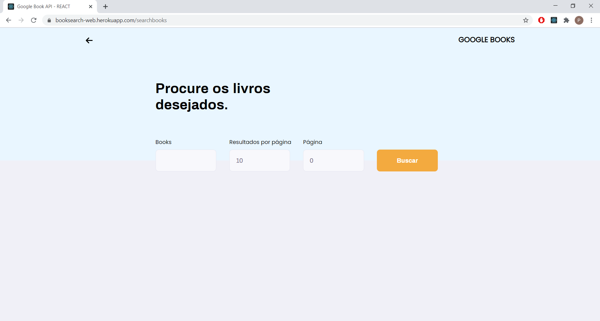
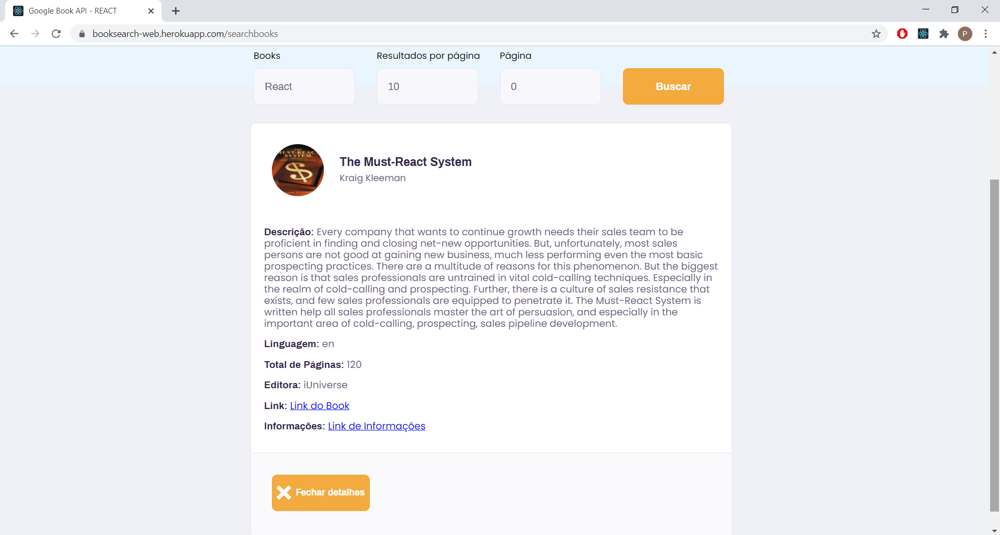
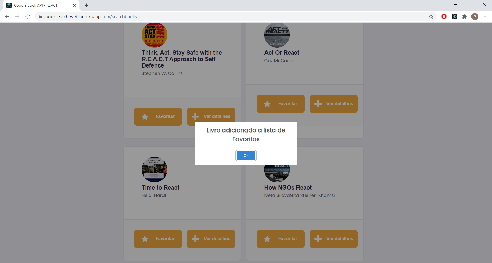
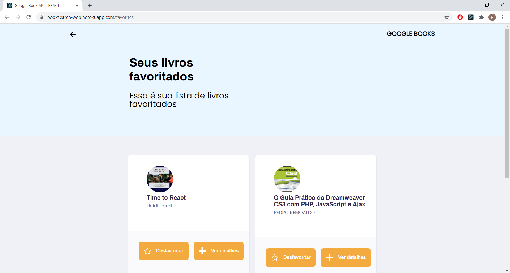

# Google Books API - React JS

 

<h2 align="center"> Desenvolvida com as tecnologias  JavaScript, 
     React JS,  Node e 
     SQLite.
</h2>

<h3> Outras recursos: </h3>
<ul>
  <li> <a href="https://expressjs.com/pt-br/"> Express </a> </li>
  <li> <a href="https://www.npmjs.com/package/axios"> Axios </a> </li>
  <li> <a href="https://www.npmjs.com/package/cors"> Cors </a> </li>
  <li> <a href="https://developers.google.com/books"> Google Book API </a> </li>
</ul>

<h4 align="justify">Para esse processo seletivo foi desenvolvido um sistema para  buscar livros disponíveis na API do Google Books. 
  O sistema desenvolvido está disponível no link a seguir: https://booksearch-web.herokuapp.com/. </h4>
<h5>Para auxiliar, foi desenvolvido uma pequeno sistema em NodeJS para armazenar, listar e excluir os livros favoritos, é possível encontrar esse sistema 
no link a seguir: https://github.com/PauloHenriqueSousa2020/GoogleBookApi_Back-end<h5> 

<h3> Para verificar o código fonte: </h3>

 Faça o download do projeto no GitHub  
 Execute <code>npm install</code> ou <code>yarn install</code> na pasta <b>GoogleBookApi_Front-end</b>, para instalar as dependências da aplicação. 
 Execute <code>npm start</code> ou <code>yarn start</code> na pasta <b>GoogleBookApi_Front-end</b> e acesse localhost:3333

<h2 align="center"> Layout da aplicação </h2>

<h3> Interface WEB: </h3>

<table>
	<tr>
		<th width="33.3%">
			Landing 
		</th>
		<th width="33.3%">
			Search Book Page
		</th>
    <th width="33.3%">
			Search React Books
		</th>
	</tr>
	<tr><!-- Prevent zebra stripes --></tr>
	<tr>
		<td>
			
		</td>
		<td>
			
		</td>
    <td>
			
		</td>
	</tr>
</table>

<table>
	<tr>
		<th width="33.3%">
			Book Details 
		</th>
		<th width="33.3%">
			Add Book to Favorited List
		</th>
    <th width="33.3%">
		  Favorited List
		</th>
	</tr>
	<tr><!-- Prevent zebra stripes --></tr>
	<tr>
		<td>
			
		</td>
		<td>
			
		</td>
    <td>
			
		</td>
	</tr>
</table>

<h3> Funcionalidades desenvolvidas: </h3>

<ul>
	<li>Listagem de Livros do Google Book</li>
	<li>Detalhamento de um Livro Específico</li>
	<li>Marcar Livro como Favorito</li>
	<li>Adicionar uma Rotina como tarefa a ser concluida</li>
	<li>Paginação</li>
	<li>Responsividade para mobile e web</li>
</ul>

<h3> Funcionalidade não desenvolvida: </h3>

<ul>
	<li>Testes Unitários</li>
</ul>

